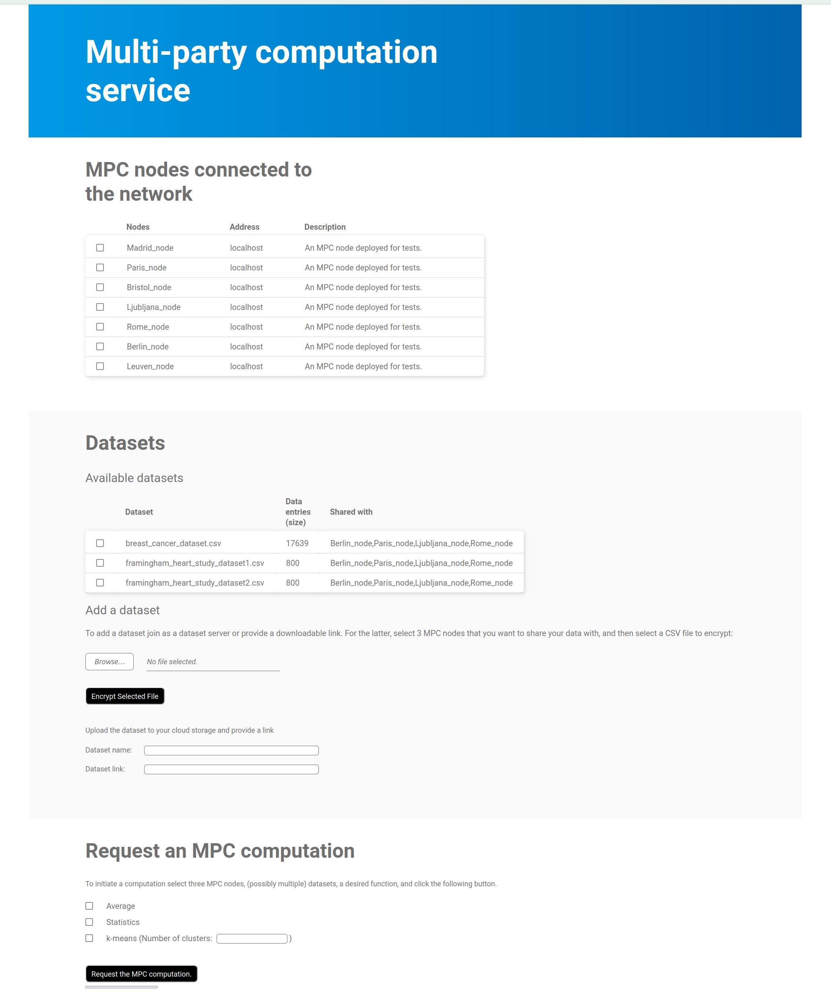

# MPC service 

MPCService allows deploying a multi-party computation service. It implements Go based services that can
play a role of an MPC node, or a data provider able to participate in an MPC protocol evaluating a
function in a privacy-preserving way. Moreover, a manager (meeting point) of the service is implemented,
providing a web interface for requesting computations and handling connections between data providers
and MPC nodes. The manager serves purely as a connector and an interface and has no access to the data.

The service needs minimal effort to be deployed (not only locally, but also over WAN), since it is
fully dockerized. It tries to be as close as possible to a system that would be deployed in production.
It uses [SCALE-MAMBA](https://github.com/KULeuven-COSIC/SCALE-MAMBA) as the underlying MPC library.

<!-- toc -->
- [Try it out!](#try-it-out)
- [Deploying an MPC service with decentralized MPC nodes, data providers, and a manager with GUI](#deploying-an-mpc-service-with-decentralized-mpc-nodes-data-providers-and-a-manager-with-gui)
    * [Connectivity requirements](#connectivity-requirements)
    * [Access and identity management](#access-and-identity-management)
    * [Running a manager](#running-a-manager)
    * [Running an MPC node](#running-an-mpc-node)
    * [Providing datasets for MPC](#providing-datasets-for-mpc)
- [Requesting computations and MPC protocol](#requesting-computations-and-mpc-protocol)
- [About the code](#about-the-code)
<!-- tocstop -->


## Try it out!

Git clone the repository and navigate yourself in `local_test` folder. Assuming that 
`docker` and `docker-compose` are installed, simply run

````docker-compose up````

After the docker images are built (this may take a while, mostly due to installing SCALE-MAMBA and
dependencies) the service will locally deploy 4 MPC nodes, a data provider and a manager. Use your
web browser to navigate yourself to [http://localhost:4100](http://localhost:4100).

Use the provided GUI to request a privacy-preserving computation using MPC.



## Deploying an MPC service with decentralized MPC nodes, data providers, and a manager with GUI

The software is preferred to be run in docker containers. To run it directly from Go code
check dockerfiles in folders `mpc_node`, `data_provider`, and `manager` to see how to install
and set up SCALE-MAMBA (and its dependencies) to be compatible with MPCService.

### Connectivity requirements
To run an MPC node, a minimal requirement is that the node has an address and an open port, on which
the other MPC nodes can reach it and start an MPC protocol.

To run a manager (a meeting point for the MPC nodes) and a GUI for requesting computations, a server
with an address and two open ports is needed.

### Access and identity management
To manage who can participate in the system, SSL certificates should be created for each participating
service. For example, you can use [certstrap](https://github.com/square/certstrap) (or other tool). Create 
a Certificate Authority:

``./certstrap init --common-name "RootCA"``

For the manager create a key, request a  and sign them (domain should be the address where the manager will be reachable):

```
./certstrap request-cert --common-name manager -domain managers.domain.com
./certstrap sign manager --CA RootCA```
```

For the participating MPC nodes and data providers create the certificates similarly (common name should be the
name of each provider, see the details bellow).

### Running a manager

#### Set up `.env`
Specify in the `.env` file in the MPCService repository the two ports on which the manager will be
available. For example
````
GUI_PORT=4000
MANAGER_PORT=4001
````
indicates that on port 4009 a GUI in a web browser is available and on port 4001 it expects that
MPC nodes and data providers will connect to it.

#### Certificates

The manager should have a certificate signed by the certificate authority in which the domain 
(DNS address) is specified. Name the certificate and the secret key `manager.crt` and `manager.key`,
respectively, and place them into folder `key_management/keys_certificates`. Place also the certificate
of the certificate authority in the same folder named as `RootCA.crt`.

#### Deployment

Run

``docker-compose up manager ``

in the main repository. Check the `http://localhost:GUI_PORT`, where the GUI
should be available.

### Running an MPC node

#### Set up `.env`
Specify in the `.env` file in the MPCService repository the following parameters. `NODE_NAME` is the name
of the MPC node, `NODE_ADDRESS` is the address on which the node can be reached, `NODE_PORT` is the
opened port through which it will be communicating with other nodes, and `MANAGER_ADDRESS` is the
address and port to reach the manager. For example
````
NODE_NAME=SuperMPCNode
NODE_ADDRESS=kraken.xlab.si
NODE_PORT=4020
MANAGER_ADDRESS=kraken.xlab.si:4001
````

#### Certificates

An MPC node should have a certificate signed by the certificate authority in which the common name
is specified and should match NODE_NAME. Name the certificate and the secret key with NODE_NAME, for
example `SuperMPCNode.crt` and `SuperMPCNode.key`, respectively, and place them into folder 
`key_management/keys_certificates`. Place also the certificate
of the certificate authority in the same folder named as `RootCA.crt`.

#### Deployment

Run

``docker-compose up mpc_node ``

in the main repository. Check on the manager's GUI if the node is connected to the system.


### Providing datasets for the MPC

The system is designed to work with datasets in CSV format. The assumption is that a dataset
is given in a file ending with `.csv`: in the first row the names of the columns should be given
while all the other fields should be numerical values. See
`data_provider/datasets/breast_canser_dataset.csv` for an example. MPC nodes can compute on one
dataset or join multiple ones without knowing the data in plaintext.  


Datasets that MPC nodes can use, can be provided in two ways:
- *as a dataset provider*: run a dataset providing service that connects to the manager and shares
provided datasets (see bellow)
- *with a link*: use the GUI functionality on the webpage of the manager to split and encrypt the dataset
    you want to offer to the MPC nodes. Upload it to a preferred storage provider and share it with a
    link. The link should be downloadable. This process splits the dataset in MPC shares that only selected
    nodes can access and use it in an MPC protocol.

While the latter process is self-explanatory, we explain in the following how to run a dataset provider
service.


#### Set up `.env`
Specify in the `.env` file in the MPCService repository the following two parameters:
`DATA_PROVIDER_NAME` is the name
of the data provider, `MANAGER_ADDRESS` is the
address and port to reach the manager, and `SHARE_WITH` specifies the names of the MPC nodes
with which the dataset provider is willing to share (encrypted parts) of its data
(one can set it to `all`) 
. For example
````
DATA_PROVIDER_NAME=SuperDataProvider
MANAGER_ADDRESS=kraken.xlab.si:4001
SHARE_WITH=SuperMPCNode1,SuperMPCNode2,SuperMPCNode3,SuperMPCNode4
````

#### Certificates

A data provider should also have a certificate signed by the certificate authority.
Name the certificate and the secret key with  DATA_PROVIDER_NAME, for
example `SuperDataProvider.crt` and `SuperDataProvider.key`, respectively, and place them into folder
`key_management/keys_certificates`. Place also the certificate
of the certificate authority in the same folder named as `RootCA.crt`.

#### Deployment

Put the datasets you want to offer in the folder `data_provider/datasets`. As explained before, these
should be CSV files. Then run

``docker-compose up data_provider``

in the main repository. Check in the browser on the manager's address if the datasets are available.


## Requesting computations and the MPC protocol

After all the MPC nodes and data providers have been connected to the manager, one can use its GUI
to request MPC computation and receive CSV files with computation results. The GUI should be available
at http://manager_address:GUI_PORT that was specified before.

#### Functions
We have provided a couple
of simple functions that can be used: average (computing the average of the columns), statistics
(computing basis statistical values of the columns of the selected datasets) and linear regression.
More functions can be added. In folder `computation/scale_files/MPCService/function` you can add additional
functions that need to be written in MAMBA language (see [SCALE-MAMBA](https://github.com/KULeuven-COSIC/SCALE-MAMBA)
documentation), see also the provided examples.


#### MPC protocol
Currently, the system is predefined to use exactly 3 nodes to evaluate an MPC computation using
a maliciously secure Shamir secret sharing based MPC protocol, in which the security assumption is
the majority of nodes are not corrupted (at most one can be corrupted to guarantee the privacy of the
data). Since SCALE-MAMBA supports also other protocols and more nodes, the software can be 
modified/upgraded to different protocols with a bit of work.

#### Upgrading the system for a particular application
**Note**: What the software does NOT implement is the management of who can request computations.
In this version, everyone that can connect to the manager can request any of the offered computations
on an arbitrary offered datasets. Implementing this part heavily depends on the application of the MPC
service. For example, if MPC service is used in a Data Market, only users that have paid
for the computation should be allowed to request it, and this should be checked by all the participating
MPC nodes to keep the system decentralized.


## About the code

The code was developed for the [KRAKEN project](https://krakenh2020.eu/) where an MPC service was
deployed for evaluating privacy preserving computations in a data market. This is a stand-alone
version of it, that could be used in other scenarios.


### Test and code coverage

The code was developed with CI and unit tests that help improve the quality, see reports of
tools on the quality of it.

### Contributions

We are more than happy to accept improvements of the code. Please open a Pull Request. 


### License

The code is licensed under the MIT license.

